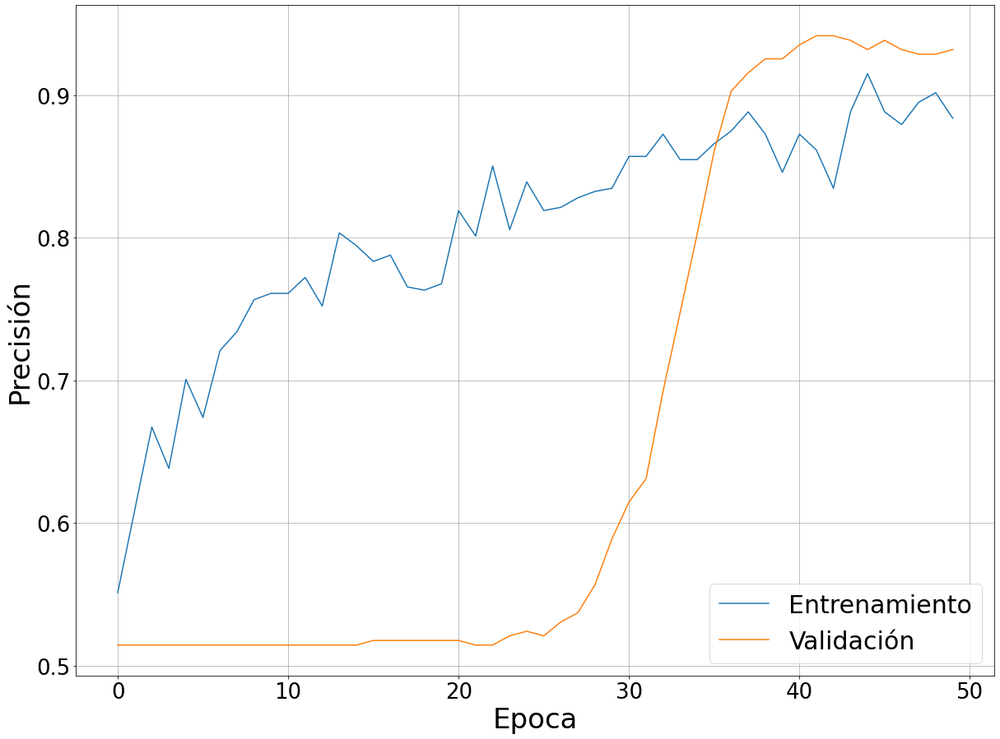

# DeteccionLLanto
Se crea modelo de deep learning para la detección de llanto de un bebe, enmarcado en el proyecto personal de monitero de neonatos, este modelo es uno de los dos modelos que se realizaran para ayudar a los cuidadores de recién nacidos. 
Para este modelo se utiliza el dataset de donate-a-cry junto al dataset de kaggle de sonidos generales, por lo que las clases de salida son 'babycry' y 'others'.
Debido a que se trabajan con archivos de sonido se utiliza librosa para la creación de la representación en imagenes, luego se utilza tensorflow con keras para la creación de una red neuronal CNN.
Se adjuntan las métricas de evaluación correspondientes para esta modelo en los archivos con nombre métrica. 

<table>
  <tr>
    <td>
         
        
   Espectrograma del llanto de un bebe  

    </td>
    <td>
         
        
   Gráfico de los coeficientes mfcc para el llanto de un bebe  

    </td>
  </tr>
</table>

Se presentan las métricas de evaluación para una red CNN utilizando los espectogramas de cada archivo de audio, en el proceso de entrenamiento se utiliza un learning rate adapativo según las métricas de entrenamiento. 
Observar que la precisión por época aumenta por cada una de las épocas, para los datos de entrenamiento y validación, alcanzando valores entorno al 90% de precisión para las 50 épocas de entrenamiento. Además, con los datos de test
se realiza la matriz de confusión obteniendo una precisión del 91% y una exactitud del 94%.

<table>
  <tr>
    <td>
      
    </td>
    <td>
      
    </td>
    <td>
      
    </td>
  </tr>
    <tr>
    <td colspan="3">
      

          Métricas de evaluación para la red CNN de los espectrogramas.     

    </td>
  </tr>
</table>

Se presentan las métricas de evaluación para una red CNN utilizando los mfcc de cada archivo de audio, se utilizan las mismas estrategias anteriores. 
Observar que la precisión por época aumenta por cada una de las épocas, para los datos de entrenamiento y validación, alcanzando valores entorno al 75% de precisión para las 50 épocas de entrenamiento. Además, con los datos de test se realiza la matriz de confusión obteniendo una precisión del 79% y una exactitud del 73%.

<table>
  <tr>
    <td>
      
    </td>
    <td>
      
    </td>
    <td>
      
    </td>
  </tr>
    <tr>
    <td colspan="3">
      

          Métricas de evaluación para la red CNN de los espectrogramas.     

    </td>
  </tr>
</table>

En el código se incluye la instrucción para obtener los modelos, para un futuro uso en otros proyectos.
 

